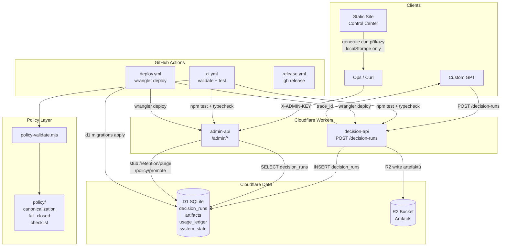

# Decision Authority — Repo Intelligence Report

> **A)** Systém pro deterministické řízení CFO/governance rozhodnutí nad Cloudflare Workers + D1 + R2 s auditní stopou a Custom GPT integrací.  
> Důkaz: `workers/decision-api/src/index.ts`, `workers/admin-api/src/routes.ts`, `custom_gpt_system_prompts/`

---

## B) Pro koho a k čemu

- **CFO / vrcholový management** – auditovatelná, reprodukovatelná rozhodnutí (hire/no-hire, spending tranche, boardové schválení)
- **Governance týmy** – vynucení policy pravidel přes fail-closed logiku, hashování artefaktů
- **Ops / SRE** – sledování runů, retence dat, propagace policy verzí
- **Custom GPT uživatelé** – GPT volá `POST /decision-runs` a dostane `trace_id`; admin je pouze manuální (curl)
- **Auditoři / právní** – každý run je uložen v D1 se stavem, hash hodnotou, verzí policy i enginu
- **Vývojáři integrace** – Cloudflare Workers jsou stateless, napojeny na D1 (SQLite) a R2 (artefakty)

Důkazy: `static-site/index.html` (sekce „Enterprise posture"), `workers/decision-api/wrangler.toml`, `workers/decision-api/migrations/`

---

## C) Struktura repozitáře

| Cesta | Role | Poznámka |
|---|---|---|
| `workers/decision-api/` | Hlavní Cloudflare Worker | Přijímá CFO runy, zapisuje do D1; public endpoint |
| `workers/admin-api/` | Admin Cloudflare Worker | CRUD nad D1; chráněno `X-ADMIN-KEY`; manuální přístup |
| `workers/decision-api/migrations/` | D1 SQL schéma | 3 migrace: init, admin tabulky, trace_id/mode sloupce |
| `workers/decision-api/src/index.test.ts` | Unit testy | Node.js `node:test`; pokrývají happy path, DB chybu, timing |
| `policy/` | Strojově čitelná policy | `canonicalization/v1.json`, `fail_closed_mapping/v1.json`, `conformance_checklist/v1.json` |
| `scripts/policy-validate.mjs` | CI validátor policy | Kontroluje existenci a syntaxi JSON policy souborů |
| `custom_gpt_system_prompts/` | System prompty pro Custom GPT | 8 GPT agentů (CFO, QA, Export, Ops, Security…) |
| `static-site/` | Ops Control Center (Cloudflare Pages) | HTML/JS SPA; ukládá config do `localStorage`; generuje curl příkazy |
| `docs/` | Dokumentace + příklady runů | OPS_RUNBOOK, SECURITY, POLICY_RELEASE (šablony); run `vsf-TEST-CFO-001` |
| `.github/workflows/` | CI/CD | `ci.yml` (PR+main), `deploy.yml` (stage/prod), `release.yml` (tag) |

---

## D) Architektura & datové toky

1. **Custom GPT** volá `POST /decision-runs` na `decision-api` Worker s JSON payloadem
2. **decision-api** vygeneruje `trace_id` (UUID), zapíše řádek do D1 tabulky `decision_runs` se stavem `PENDING`
3. Vrátí `{ trace_id }` — GPT používá `trace_id` pro auditní stopu
4. **admin-api** slouží operátorům; endpoint `GET /admin/runs` vrací posledních N runů z D1
5. Auth gate: všechny `/admin/*` požadavky musí nést hlavičku `X-ADMIN-KEY` (Cloudflare Worker secret)
6. **Cloudflare D1** sdílí databáze mezi oběma Workers (stejné `database_id` dle prostředí)
7. **Cloudflare R2** je připojen jako bucket pro artefakty (bindingy `R2`); aktuálně ne plně využit v kódu
8. **Static site** (Cloudflare Pages) je Ops Control Center — generuje curl příkazy, ukládá pouze URL do localStorage
9. **Policy validace** probíhá v CI (`scripts/policy-validate.mjs`) před spuštěním testů Workers
10. **Migrace** aplikuje `wrangler d1 migrations apply` v deploy workflow před nasazením Workers
11. **Nasazení** na stage: každý push na `main`; na prod: push tagu `v*`
12. **Custom GPT agenti** (8 rolí) jsou definováni system prompty; komunikují s Workers přes standardní REST volání



---

## E) Mapa rozhraní

### E1) HTTP endpointy

| Metoda | Path | Worker | Auth | Vstup / Výstup | Poznámka |
|---|---|---|---|---|---|
| `POST` | `/decision-runs` | decision-api | — | JSON body → `{ trace_id }` | Zapíše do D1; kód v `src/index.ts` |
| `GET` | `/admin/health` | admin-api | `X-ADMIN-KEY` | — → `{ ok, ts }` | Health check |
| `GET` | `/admin/runs` | admin-api | `X-ADMIN-KEY` | `?limit=N` → `{ rows[], count, newest_created_at }` | D1 SELECT, default limit 50, max 200 |
| `POST` | `/admin/retention/purge` | admin-api | `X-ADMIN-KEY` | — → `{ ok: true }` | Stub (neimplementováno) |
| `POST` | `/admin/policy/promote` | admin-api | `X-ADMIN-KEY` | — → `{ ok: true }` | Stub (neimplementováno) |

Důkaz: `workers/admin-api/src/routes.ts`, `workers/decision-api/src/index.ts`

### E2) Eventy / Cron / Queue

| Typ | Spouštěč | Handler | Payload | Side effects |
|---|---|---|---|---|
| CI workflow | PR nebo push na `main` | `.github/workflows/ci.yml` | — | policy-validate + typecheck + test obou Workers |
| Deploy stage | Push na větev `main` | `.github/workflows/deploy.yml` (job `deploy-stage`) | — | D1 migrace + wrangler deploy do stage |
| Deploy prod | Push tagu `v*` | `.github/workflows/deploy.yml` (job `deploy-prod`) | — | D1 migrace + wrangler deploy do prod |
| Release | Push tagu `v*` | `.github/workflows/release.yml` | — | GitHub Release s auto-generated notes |

---

## F) Jak spustit / testovat / buildit / deployovat

### Prerekvizity
- Node.js 20+
- [Wrangler CLI](https://developers.cloudflare.com/workers/cli-wrangler/) (`npm install -g wrangler`)
- Cloudflare účet s D1 a R2 přístupem

### Instalace závislostí
```bash
cd workers/decision-api && npm ci
cd workers/admin-api   && npm ci
```

### Typová kontrola
```bash
cd workers/decision-api && npm run typecheck
cd workers/admin-api   && npm run typecheck
```

### Testy
```bash
# decision-api (má unit testy)
cd workers/decision-api && npm test

# admin-api (žádné testy; příkaz spustí node --test, projde prázdně)
cd workers/admin-api && npm test
```

### Policy validace
```bash
node scripts/policy-validate.mjs
```

### Lokální dev (Wrangler dev server)
```bash
# navržené — není explicitně v package.json
cd workers/decision-api && npx wrangler dev
cd workers/admin-api   && npx wrangler dev
```

### Deploy na stage
```bash
cd workers/decision-api
npx wrangler d1 migrations apply decision_authority_stage --remote --env stage
npx wrangler deploy --env stage

cd workers/admin-api
npx wrangler deploy --env stage
```

### Deploy na prod
```bash
# Automaticky při push tagu v* — nebo manuálně:
git tag v1.0.0 && git push --tags
```

---

## G) CI/CD přehled

| Soubor | Účel | Spouští se |
|---|---|---|
| `.github/workflows/ci.yml` | Validace policy JSON + typecheck + testy obou Workers | Každý PR a push na `main` |
| `.github/workflows/deploy.yml` | Wrangler deploy na stage (main) nebo prod (tag v*) | Push na `main` nebo tag `v*` |
| `.github/workflows/release.yml` | Vytvoří GitHub Release s auto-notes | Push tagu `v*` |

Potřebná secrets v GitHub Actions: `CLOUDFLARE_API_TOKEN`, `CLOUDFLARE_ACCOUNT_ID` (+ `GITHUB_TOKEN` je automatický).

---

## H) Integrace & konfigurace

### ENV proměnné / secrets

| Název | Worker | Kde se čte | Typ |
|---|---|---|---|
| `ENV` | decision-api, admin-api | `wrangler.toml` `[vars]` | var (dev/stage/prod) |
| `POLICY_VERSION` | decision-api | `wrangler.toml` `[vars]`, `src/index.ts` řádek ~14 | var |
| `ENGINE_VERSION` | decision-api | `wrangler.toml` `[vars]`, `src/index.ts` řádek ~15 | var |
| `REQUIRE_TRIGGERS` | decision-api | `wrangler.toml` `[vars]` | var (true/false) |
| `REQUIRE_GATING` | decision-api | `wrangler.toml` `[vars]` | var (true/false) |
| `ADMIN_KEY` | admin-api | `src/routes.ts` řádek ~8 (`env.ADMIN_KEY`) | **secret** — Cloudflare Worker secret |
| `CLOUDFLARE_API_TOKEN` | CI/CD | `.github/workflows/deploy.yml` | GitHub secret |
| `CLOUDFLARE_ACCOUNT_ID` | CI/CD | `.github/workflows/deploy.yml` | GitHub secret |

### Cloudflare bindingy (wrangler.toml)

| Binding | Typ | Prostředí | Hodnota |
|---|---|---|---|
| `DB` | D1 Database | stage | `decision_authority_stage` |
| `DB` | D1 Database | prod | `decision_authority_prod` |
| `R2` | R2 Bucket | stage | `decision-authority-artifacts-stage` |
| `R2` | R2 Bucket | prod | `decision-authority-artifacts-prod` |

### Externí služby

- **Cloudflare D1** – primární úložiště (SQLite); oba Workers sdílí stejné DB
- **Cloudflare R2** – úložiště artefaktů; binding přítomný, ale plné využití zatím v kódu není implementováno
- **Cloudflare Pages** – hosting `static-site/` jako Ops Control Center
- **Custom GPT (OpenAI)** – volá `decision-api` REST endpoint; nemá přímý přístup k admin-api
- **GitHub Actions** – CI/CD pipeline; používá `wrangler` pro deploy

---

## I) Rizika / dluh / sporná místa

1. **`POST /decision-runs` bez auth** – veřejný endpoint bez autentizace; libovolný klient může vytvořit run. *Střední riziko.* Doporučeno: přidat API klíč nebo rate limiting.
2. **Admin stubs** – `/admin/retention/purge` a `/admin/policy/promote` vrací vždy `{ ok: true }` bez logiky. *Technický dluh.*
3. **R2 nevyužito v kódu** – binding existuje, ale Workers s R2 reálně nepracují. *Nekonzistence.*
4. **Žádné testy admin-api** – `workers/admin-api` nemá žádné testy. *Riziko regresí.*
5. **`mode` a `trace_id` null** – migrace 0003 přidává sloupce jako nullable; `decision-api` nevyplňuje `mode`. *Datová nekonzistence.*
6. **Docs jsou šablony** – `docs/OPS_RUNBOOK.md`, `docs/SECURITY.md`, `docs/POLICY_RELEASE.md` obsahují jen text `(Template)`.
7. **Chybí `.env.example`** – nový vývojář neví, jaké proměnné nastavit.
8. **Hash TODO** – policy artefakty obsahují `HASH_TODO` placeholdery; CI krok pro výpočet hashů chybí.
9. **Žádný rate limiting** – Workers nemají žádnou ochranu proti flooding útokům.
10. **`REQUIRE_TRIGGERS` / `REQUIRE_GATING` nevynuceno** – proměnné jsou definovány, ale `decision-api` s nimi v kódu nepracuje.

---

## J) Doporučené další kroky (top 5, do 30–60 min)

1. **Auth pro `POST /decision-runs`** (30 min) — přidat volitelný `X-API-KEY` header nebo Cloudflare Access pravidlo
2. **Testy admin-api** (45 min) — doplnit `workers/admin-api/src/index.test.ts` paralelně s existujícím vzorem v decision-api
3. **Implementace admin stubů** (30 min) — `/admin/retention/purge`: DELETE FROM decision_runs WHERE created_at < cutoff; `/admin/policy/promote`: UPDATE system_state
4. **Vyplnění `mode` při insertu** (15 min) — `decision-api/src/index.ts` přečíst `mode` z request body a uložit do D1
5. **CI krok pro SHA-256 hashování artefaktů** (45 min) — doplnit do `scripts/policy-validate.mjs` nebo nový skript

---

## K) Návrh PR — co přidat/změnit v dokumentaci

| Soubor | Typ změny | Popis |
|---|---|---|
| `README.md` | Přepsání | Tento dokument — overview, quickstart, architektura (Mermaid), API reference, config |
| `.env.example` | Nový soubor | Env proměnné s komentáři |
| `docs/audit.md` | Nový soubor | Auditní dotazy, výstupy, evidence index |
| `docs/OPS_RUNBOOK.md` | Rozšíření šablony | Přidat deployment steps, health check commands |
| `docs/SECURITY.md` | Rozšíření šablony | Popis auth mechanismů, threat model |

---

## Co bych ověřil dotazem na autora

1. **Má `decision-api` plánovanou autentizaci?** Endpoint `POST /decision-runs` je veřejný — záměr nebo mezera?
2. **Kdy budou implementovány admin stuby** (`/retention/purge`, `/policy/promote`)?
3. **Jak se reálně používá R2 binding?** Kód R2 nezapisuje — je to plán nebo zapomenutý feature?
4. **Jaké je zamýšlené URL schéma Cloudflare Pages?** V kódu je hardcoded `decision-authority.pages.dev` a `victorain92.workers.dev`.
5. **Je `vsf-TEST-CFO-001` reálný run nebo jen testovací příklad?** Obsahuje citlivá finanční data — záměr commitovat do veřejného repo?
6. **Jak se Custom GPT autentizuje vůči `decision-api`?** Žádná auth na endpointu není patrná z kódu.

---

## Původní obsah (archivní)

> Generated: 2026-02-22  
> This zip includes: Custom GPT system prompts, GitHub Actions CI/CD workflows, Cloudflare Workers wrangler configs (stage/prod), D1 migrations (including usage_ledger + system_state), Minimal docs templates, Proof PDF: `assets/proof/board-ready-micro-cases.pdf`
