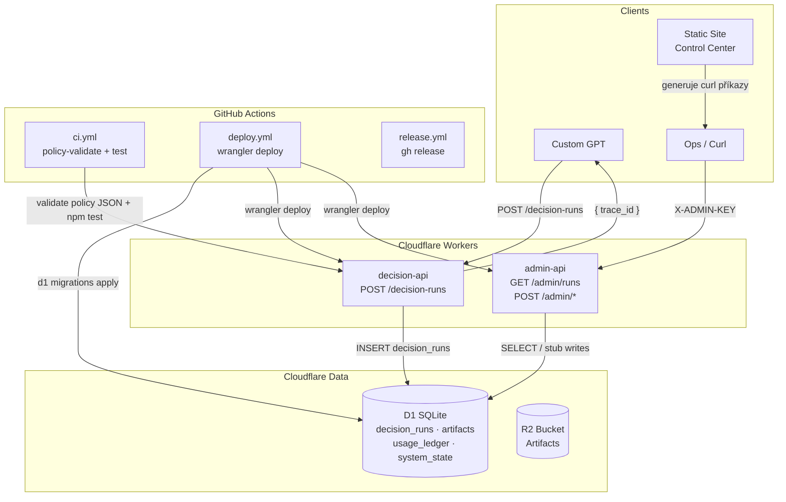

# Decision Authority

**A)** Platforma pro deterministické CFO/governance rozhodnutí: Custom GPT odešle strukturovaný případ přes REST API, systém ho uloží do auditní databáze s `trace_id`, a operátor může výsledky zkontrolovat přes admin API chráněné klíčem.

---

## B) Pro koho a k čemu

- **CFO / management** – auditovatelná, reprodukovatelná rozhodnutí (hire/no-hire, spending tranche, boardové schválení) s plnou historií v D1
- **Custom GPT uživatelé** – GPT volá `POST /decision-runs` a dostane `trace_id`; vše ostatní je manuální (curl)
- **Ops / SRE** – sledování runů (`GET /admin/runs`), budoucí retence a propagace policy verzí
- **Governance / Auditoři** – každý run je uložen se stavem, verzí policy i enginu, hash hodnotou a stopou
- **Vývojáři integrace** – dva Cloudflare Workers (stateless) napojené na sdílenou D1 (SQLite) a R2 (artefakty)

---

## C) Struktura repozitáře

| Cesta | Role |
|---|---|
| `workers/decision-api/` | Hlavní Worker — přijímá CFO runy, zapisuje do D1, vrací `trace_id`; veřejný endpoint |
| `workers/admin-api/` | Admin Worker — čtení runů a správa DB; chráněno hlavičkou `X-ADMIN-KEY` |
| `workers/decision-api/migrations/` | D1 SQL schéma — 3 migrace: init tabulky, admin tabulky, trace_id/mode sloupce |
| `workers/decision-api/src/index.test.ts` | Unit testy — Node.js `node:test`; happy path, DB chyba, timing |
| `policy/` | Strojově čitelná policy — canonicalization, fail_closed_mapping, conformance_checklist |
| `scripts/policy-validate.mjs` | CI validátor — ověřuje existenci a syntaxi JSON policy souborů |
| `custom_gpt_system_prompts/` | System prompty pro 8 Custom GPT agentů (CFO, QA, Export, Ops, Security…) |
| `static-site/` | Ops Control Center (Cloudflare Pages) — generuje curl příkazy, ukládá URL do `localStorage` |
| `docs/` | Dokumentace + ukázkový run `vsf-TEST-CFO-001`; `OPS_RUNBOOK`, `SECURITY`, `POLICY_RELEASE` jsou zatím šablony |
| `.github/workflows/` | CI/CD: `ci.yml` (testy), `deploy.yml` (stage/prod), `release.yml` (GitHub Release) |

---

## D) Quickstart — spuštění, testy, deploy

### Prerekvizity
- Node.js 20+
- Wrangler CLI: `npm install -g wrangler`
- Cloudflare účet s D1 a R2 přístupem

### Instalace & kontrola

```bash
# 1. Instalace závislostí
cd workers/decision-api && npm ci
cd ../admin-api         && npm ci

# 2. Typová kontrola
cd workers/decision-api && npm run typecheck
cd workers/admin-api    && npm run typecheck

# 3. Policy validace
node scripts/policy-validate.mjs

# 4. Unit testy (decision-api)
cd workers/decision-api && npm test
```

### Lokální vývoj

```bash
# Wrangler dev server (navržené — není v package.json scripts)
cd workers/decision-api && npx wrangler dev
cd workers/admin-api    && npx wrangler dev
```

### Deploy

```bash
# Stage (automaticky při push na main, nebo manuálně):
cd workers/decision-api
npx wrangler d1 migrations apply decision_authority_stage --remote --env stage
npx wrangler deploy --env stage
cd ../admin-api && npx wrangler deploy --env stage

# Prod (automaticky při push tagu v*, nebo manuálně):
git tag v1.0.0 && git push --tags
```

### Smoke test (po deployi)

```bash
# Vytvoř decision run (veřejný endpoint):
curl -s "https://decision-api-stage.victorain92.workers.dev/decision-runs" \
  -H "content-type: application/json" \
  -d '{"trace_id":"vsf-test-001","mode":"JOB","policy_version":"v1","engine_version":"v0.1.0","input_text":"test"}' | jq

# Admin health (vyžaduje ADMIN_KEY):
curl -s "https://admin-api-stage.victorain92.workers.dev/admin/health" \
  -H "x-admin-key: $ADMIN_KEY" | jq
```

---

## E) CI/CD přehled

| Workflow | Spouští se | Co dělá |
|---|---|---|
| `.github/workflows/ci.yml` | Každý PR + push na `main` | policy-validate → typecheck + `npm test` pro oba Workers |
| `.github/workflows/deploy.yml` | Push na `main` (stage) / tag `v*` (prod) | D1 migrace → `wrangler deploy` oba Workers |
| `.github/workflows/release.yml` | Push tagu `v*` | Vytvoří GitHub Release s auto-generated notes |

Potřebná GitHub Actions secrets: `CLOUDFLARE_API_TOKEN`, `CLOUDFLARE_ACCOUNT_ID`.

---

## F) Integrace & konfigurace

### ENV proměnné (Workers)

| Proměnná | Worker | Typ | Popis |
|---|---|---|---|
| `ENV` | oba | var | Prostředí: `dev` / `stage` / `prod` |
| `POLICY_VERSION` | decision-api | var | Verze policy stamped na každý run |
| `ENGINE_VERSION` | decision-api | var | Verze enginu stamped na každý run |
| `REQUIRE_TRIGGERS` | decision-api | var | `true`/`false` — definováno, zatím nevynucováno v kódu |
| `REQUIRE_GATING` | decision-api | var | `true`/`false` — definováno, zatím nevynucováno v kódu |
| `ADMIN_KEY` | admin-api | **secret** | Klíč pro `/admin/*` — nastavit přes `wrangler secret put` |

### Secrets pro CI/CD (GitHub)

| Secret | Kde se používá |
|---|---|
| `CLOUDFLARE_API_TOKEN` | `.github/workflows/deploy.yml` — wrangler auth |
| `CLOUDFLARE_ACCOUNT_ID` | `.github/workflows/deploy.yml` — wrangler auth |

### Cloudflare bindingy

| Binding | Typ | stage | prod |
|---|---|---|---|
| `DB` | D1 SQLite | `decision_authority_stage` | `decision_authority_prod` |
| `R2` | R2 Bucket | `decision-authority-artifacts-stage` | `decision-authority-artifacts-prod` |

### Externí služby

- **Cloudflare D1** — primární DB; tabulky `decision_runs`, `artifacts`, `audit_events`, `usage_ledger`, `system_state`
- **Cloudflare R2** — bucket pro artefakty; binding přítomný, zápis zatím neimplementován v kódu
- **Cloudflare Pages** — hosting `static-site/` (Ops Control Center)
- **Custom GPT / OpenAI** — klient volá `POST /decision-runs`; nemá přístup k admin-api

---

## G) Nejasnosti / chybějící informace

1. **`POST /decision-runs` bez auth** — endpoint je veřejný; není jasné, zda jde o záměr (Custom GPT nepodporuje autentizaci snadno) nebo mezeru v bezpečnosti
2. **R2 nevyužito** — binding existuje v `wrangler.toml` i `Env` interface, ale žádný kód do R2 nezapisuje; plán nebo zapomenutý feature?
3. **`REQUIRE_TRIGGERS` / `REQUIRE_GATING`** — proměnné jsou definovány, ale `decision-api` je v kódu nepoužívá; kdy budou vynuceny?
4. **Admin stuby** — `/admin/retention/purge` a `/admin/policy/promote` vracejí vždy `{ ok: true }` bez logiky; kdy budou implementovány?
5. **`mode` nevyplňován** — migrace 0003 přidala sloupec `mode`, ale `decision-api` ho při insertu neposílá; datová nekonzistence
6. **`vsf-TEST-CFO-001`** — run v `docs/cfo_runs/` obsahuje konkrétní finanční čísla; záměr ho commitovat do veřejného repo?

---

## H) Doporučené další kroky

1. **Auth pro `POST /decision-runs`** _(~30 min)_ — přidat volitelný `X-API-KEY` header nebo Cloudflare Access pravidlo; aktuálně libovolný klient může vytvořit run
2. **Testy admin-api** _(~45 min)_ — doplnit `workers/admin-api/src/index.test.ts` podle vzoru v decision-api; aktuálně nulové pokrytí
3. **Implementace admin stubů** _(~30 min)_ — `/admin/retention/purge`: `DELETE FROM decision_runs WHERE created_at < ?`; `/admin/policy/promote`: `UPDATE system_state SET value = ? WHERE key = 'active_policy_version'`
4. **Vyplnit `mode` při insertu** _(~15 min)_ — přečíst `mode` z request body v `decision-api/src/index.ts` a uložit do D1
5. **Vyplnit šablonové docs** _(~60 min)_ — `docs/OPS_RUNBOOK.md`, `docs/SECURITY.md`, `docs/POLICY_RELEASE.md` obsahují jen `(Template)`; doplnit alespoň základní obsah

---

## Architektura



### HTTP endpointy

| Metoda | Path | Worker | Auth | Výstup |
|---|---|---|---|---|
| `POST` | `/decision-runs` | decision-api | — (veřejný) | `{ trace_id }` |
| `GET` | `/admin/health` | admin-api | `X-ADMIN-KEY` | `{ ok, ts }` |
| `GET` | `/admin/runs` | admin-api | `X-ADMIN-KEY` | `{ rows[], count, newest_created_at }` |
| `POST` | `/admin/retention/purge` | admin-api | `X-ADMIN-KEY` | `{ ok: true }` _(stub)_ |
| `POST` | `/admin/policy/promote` | admin-api | `X-ADMIN-KEY` | `{ ok: true }` _(stub)_ |

---

> Podrobná auditní stopa (ripgrep dotazy + výsledky) je v [`docs/audit.md`](docs/audit.md).  
> Vzorový env soubor je v [`.env.example`](.env.example).
